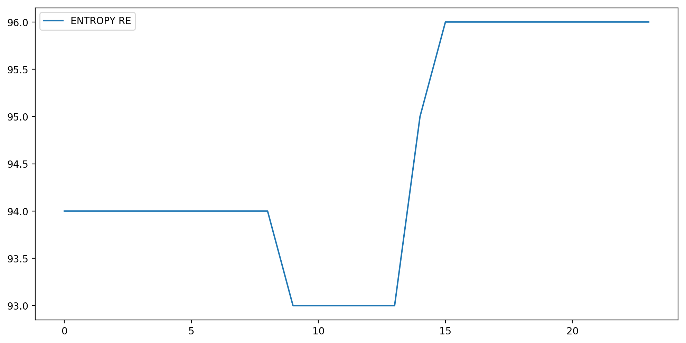
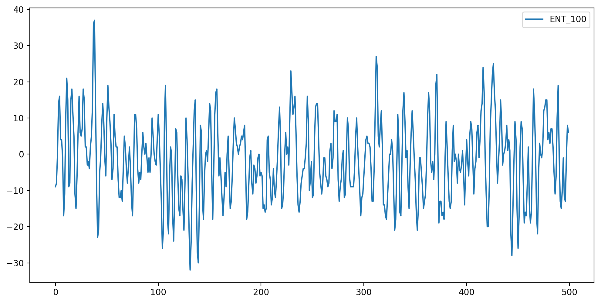
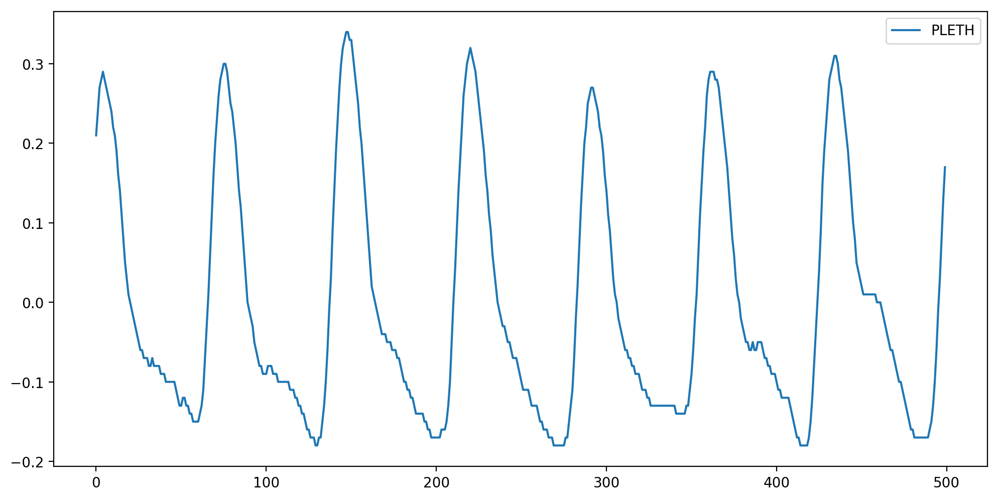
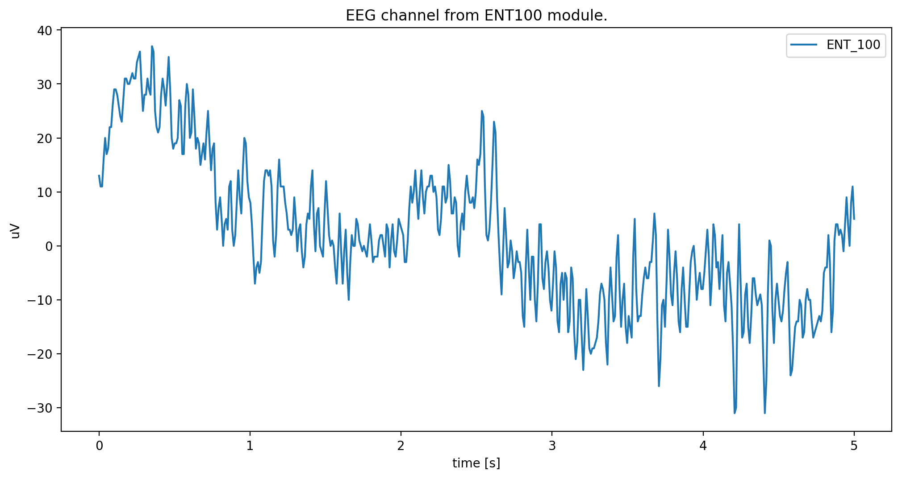
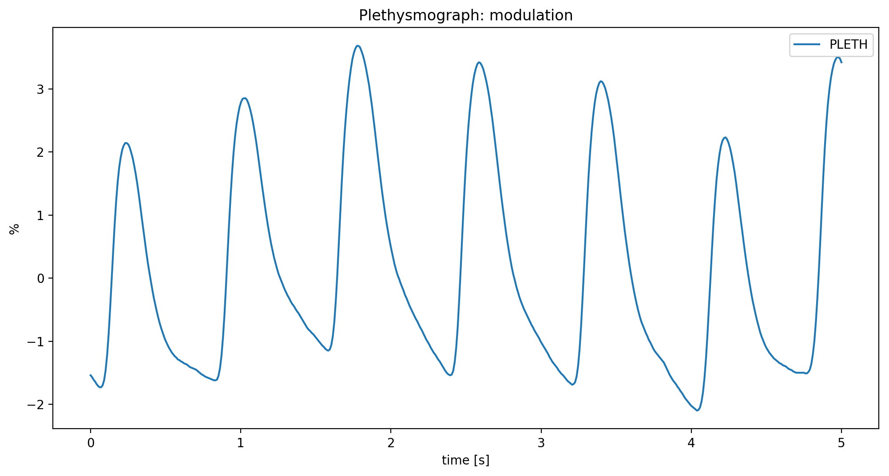

Examples
========

.. code:: ipython3

    import numpy
    from matplotlib import pyplot
    from pycollect import GEDevice, GEDecode, database, measures

Read RAW file
-------------

The **PyCollect** library include a set of prerecorded database for
debug purposes.

.. code:: ipython3

    for raw in database.RAWS_ABSPATH:
        print("RAW file path: {}".format(raw))

.. parsed-literal::

    RAW file path: /usr/lib/python3.6/site-packages/pycollect-1.0-py3.6.egg/pycollect/database/db02.raw
    RAW file path: /usr/lib/python3.6/site-packages/pycollect-1.0-py3.6.egg/pycollect/database/db00.raw
    RAW file path: /usr/lib/python3.6/site-packages/pycollect-1.0-py3.6.egg/pycollect/database/db01.raw

.. code:: ipython3

    # Read the file
    file = open(database.RAWS_ABSPATH[1], 'rb')
    data = file.read()
    data = data[:int(4e4)]
    file.close()
    
    decoder = GEDecode(data)
    
    # Buffer and modules
    print("Buffer size: {} bytes".format(len(decoder.BUFFER)))
    print("Modules detected: {}".format(decoder.MODULES))
    print("Modules active: {}".format(decoder.MODULES_ACTIVE))
    
    # Available labels
    print("Trends: {}".format(decoder.DATA_SUBRECORD.columns.tolist()))
    print("Waves: {}".format(list(decoder.DATA_WAVE.keys())))
    
    pyplot.figure(figsize=(12,6), dpi=200)
    pyplot.plot(decoder.DATA_SUBRECORD['ENTROPY RE'])
    pyplot.legend(['ENTROPY RE'])
    
    pyplot.figure(figsize=(12,6), dpi=200)
    pyplot.plot(decoder.DATA_WAVE['ENT_100']['values'][:500]) 
    pyplot.legend(['ENT_100'])
    
    pyplot.figure(figsize=(12,6), dpi=200)
    pyplot.plot(decoder.DATA_WAVE['PLETH']['values'][:500])
    pyplot.legend(['PLETH'])

.. parsed-literal::

    Buffer size: 40000 bytes
    Modules detected: ['INV-BP (p1)', 'INV-BP (p2)', 'ECG', 'NIBP', 'SpO2', 'NMT', 'ECG-EXTRA', 'ECG-ARRH', 'ECG-12', 'NMT2', 'ENTROPY']
    Modules active: ['ECG', 'NIBP', 'SpO2', 'NMT', 'ECG-EXTRA', 'ECG-ARRH', 'ECG-12', 'NMT2', 'ENTROPY']
    Trends: ['AA', 'AA ET', 'AA FI', 'AA MAC-SUM', 'AA2 MAC-AGE-SUM', 'AA: CLBR', 'AA: MNS', 'BAL-GAS ET', 'BAL-GAS FI', 'CO-WEDGE CO', 'CO-WEDGE CO-AGE', 'CO-WEDGE PCWP', 'CO-WEDGE PCWP-AGE', 'CO-WEDGE REF', 'CO-WEDGE TEMP', 'CO2 ET', 'CO2 FI', 'CO2 LBL', 'CO2 PAMB', 'CO2 RR', 'CO2: ALK', 'CO2: AP', 'CO2: CLBR', 'CO2: CS', 'CO2: MNS', 'CO2: OC', 'CO2: ZS', 'ECG HR', 'ECG HR-SRC', 'ECG IMP-RR', 'ECG LEAD-CH1', 'ECG LEAD-CH2', 'ECG LEAD-CH3', 'ECG ST1', 'ECG ST2', 'ECG ST3', 'ECG-12 LEAD-CH1', 'ECG-12 LEAD-CH2', 'ECG-12 LEAD-CH3', 'ECG-12 STAVF', 'ECG-12 STAVL', 'ECG-12 STAVR', 'ECG-12 STI', 'ECG-12 STII', 'ECG-12 STIII', 'ECG-12 STV1', 'ECG-12 STV2', 'ECG-12 STV3', 'ECG-12 STV4', 'ECG-12 STV5', 'ECG-12 STV6', 'ECG-ARRH HR', 'ECG-ARRH PVC', 'ECG-ARRH RR', 'ECG-EXTRA: HR', 'ECG-EXTRA: HR-MAX', 'ECG-EXTRA: HR-MIN', 'ECG: AR', 'ECG: ASY', 'ECG: CH1', 'ECG: CH2', 'ECG: CH3', 'ECG: LRN', 'ECG: NS', 'ECG: PCR', 'EEG EEG1-ALPHA', 'EEG EEG1-AMPL', 'EEG EEG1-BETA', 'EEG EEG1-BSR', 'EEG EEG1-DELTA', 'EEG EEG1-MNF', 'EEG EEG1-SFR', 'EEG EEG1-THETA', 'EEG EEG2-ALPHA', 'EEG EEG2-AMPL', 'EEG EEG2-BETA', 'EEG EEG2-BSR', 'EEG EEG2-DELTA', 'EEG EEG2-MF', 'EEG EEG2-SFR', 'EEG EEG2-THETA', 'EEG EEG3 BSR', 'EEG EEG3-ALPHA', 'EEG EEG3-AMPL', 'EEG EEG3-BETA', 'EEG EEG3-DELTA', 'EEG EEG3-MF', 'EEG EEG3-SEF', 'EEG EEG3-THETA', 'EEG EEG4-ALPHA', 'EEG EEG4-AMPL', 'EEG EEG4-BETA', 'EEG EEG4-BSR', 'EEG EEG4-DELTA', 'EEG EEG4-MF', 'EEG EEG4-SEF', 'EEG EEG4-THETA', 'EEG FEMG', 'EEG-BIS', 'EEG-BIS EMG', 'EEG-BIS SQI', 'EEG-BIS SR', 'EEG2 CH1M', 'EEG2 CH1P', 'EEG2 CH2M', 'EEG2 CH2P', 'EEG2 CH3M', 'EEG2 CH3P', 'EEG2 CH4M', 'EEG2 CH4P', 'EEG2 COMMON', 'EEG: CH1-ARTF', 'EEG: CH1-LEADS', 'EEG: CH1-NS', 'EEG: CH2-ARTF', 'EEG: CH2-LEADS', 'EEG: CH2-NS', 'EEG: CH3-ARTF', 'EEG: CH3-LEADS', 'EEG: CH3-NS', 'EEG: CH4-ARTF', 'EEG: CH4-LEADS', 'EEG: CH4-NS', 'EEG: EP', 'EEG: HEAD', 'EEG: MONTAGE', 'EEG: MSN', 'EEG: SSEP', 'ENTROPY BSR', 'ENTROPY RE', 'ENTROPY SE', 'FLOW-VOL COMP', 'FLOW-VOL MV-EXP', 'FLOW-VOL PEEP', 'FLOW-VOL PPEAK', 'FLOW-VOL PPLAT', 'FLOW-VOL RR', 'FLOW-VOL TV-EXP', 'FLOW-VOL TV-INSP', 'FLOW-VOL2 EPEEP', 'FLOW-VOL2 EXPTIME', 'FLOW-VOL2 IERATIO', 'FLOW-VOL2 IPEEP', 'FLOW-VOL2 ISPTIME', 'FLOW-VOL2 MVESEX', 'FLOW-VOL2 MVINSP', 'FLOW-VOL2 Pmean', 'FLOW-VOL2 RAW', 'FLOW-VOL2 STCCOMP', 'FLOW-VOL2 STCPEEPE', 'FLOW-VOL2 STCPEEPI', 'FLOW-VOL2 STCPPLAT', 'FLOW-VOL: CLBR', 'FLOW-VOL: DIS', 'FLOW-VOL: LK', 'FLOW-VOL: MSR', 'FLOW-VOL: OBS', 'FLOW-VOL: ZR', 'GASEX EE', 'GASEX RQ', 'GASEX VCO2', 'GASEX VO2', 'INV-BP DIA (p1)', 'INV-BP DIA (p2)', 'INV-BP DIA (p3)', 'INV-BP DIA (p4)', 'INV-BP DIA (p5)', 'INV-BP DIA (p6)', 'INV-BP HR (p1)', 'INV-BP HR (p2)', 'INV-BP HR (p3)', 'INV-BP HR (p4)', 'INV-BP HR (p5)', 'INV-BP HR (p6)', 'INV-BP LBL (p1)', 'INV-BP LBL (p2)', 'INV-BP LBL (p3)', 'INV-BP LBL (p4)', 'INV-BP LBL (p5)', 'INV-BP LBL (p6)', 'INV-BP MEAN (p1)', 'INV-BP MEAN (p2)', 'INV-BP MEAN (p3)', 'INV-BP MEAN (p4)', 'INV-BP MEAN (p5)', 'INV-BP MEAN (p6)', 'INV-BP SYS (p1)', 'INV-BP SYS (p2)', 'INV-BP SYS (p3)', 'INV-BP SYS (p4)', 'INV-BP SYS (p5)', 'INV-BP SYS (p6)', 'INV-BP: ZR (p1)', 'INV-BP: ZR (p2)', 'INV-BP: ZR (p3)', 'INV-BP: ZR (p4)', 'INV-BP: ZR (p5)', 'INV-BP: ZR (p6)', 'N2O ET', 'N2O FI', 'N2O: CLBR', 'N2O: MNS', 'NIBP CUFF', 'NIBP DIA', 'NIBP HR', 'NIBP MEAN', 'NIBP SYS', 'NIBP: AUTO', 'NIBP: CLBR', 'NIBP: MSR', 'NIBP: OLD', 'NIBP: STASIS', 'NIBP: STAT', 'NMT PTC-COUNT', 'NMT PTC-DB-COUNT', 'NMT PTC-ST-COUNT', 'NMT PTC-STIM', 'NMT PTC-TOF-COUNT', 'NMT STM', 'NMT T1', 'NMT TIME', 'NMT TRATIO', 'NMT2 T1', 'NMT2 T2', 'NMT2 T3', 'NMT2 T4', 'NMT: CLBR', 'NMT: SUP', 'O2 ET', 'O2 FI', 'SpO2', 'SpO2 IR-AMP', 'SpO2 LBL', 'SpO2 PR', 'SpO2 [SO2|SaO2|SvO2]', 'SvO2', 'TEMP (t1)', 'TEMP (t2)', 'TEMP (t3)', 'TEMP (t4)', 'TEMP LBL (t1)', 'TEMP LBL (t2)', 'TEMP LBL (t3)', 'TEMP LBL (t4)', 'TONO CMPA', 'TONO P(r-Et)CO2', 'TONO P(r-a)CO2', 'TONO PADELAY', 'TONO PAMB', 'TONO PHI', 'TONO PHIDELAY', 'TONO PrCO2', 'TONO: LEAK', 'TONO: OVER', 'TONO: TECHFAIL', 'TONO: UNFILL', 'TONO: VOLDR', 'datetime']
    Waves: ['PLETH', 'ENT_100']

.. parsed-literal::

    <matplotlib.legend.Legend at 0x7f4442e442b0>

Read from monitor
-----------------

.. code:: ipython3

    device = GEDevice(database.RAWS_ABSPATH[0])
    decoder = GEDecode(device.BUFFER)
    # device.connect('/dev/ttyUSB0')

The monitor will send all ``subrecords`` data but the waves need an
explicit request.

.. code:: ipython3

    default = device.DEFAULT_REQUEST
    print("Default data requested: {}".format(default))
    
    # Activate the trends transmission
    device.request(subtype=device.DISPL)
    
    # Activate the waves transmission
    device.request(waveform_set=['ENT_100', 'PLETH'])

.. parsed-literal::

    Default data requested: ['date', 'ENTROPY RE', 'ENTROPY SE', 'ENTROPY BSR', 'NIBP SYS', 'NIBP DIA', 'NIBP MEAN', 'ECG IMP-RR', 'ECG HR', 'TEMP (t1)', 'CO2 FI', 'CO2 ET', 'ECG1', 'ENT_100', 'PLETH']

.. code:: ipython3

    # Start the asynchronous data collecting and process
    device.collect(True)
    decoder.process(True)
    
    import time
    time.sleep(20)

.. code:: ipython3

    # Buffer and modules
    print("Buffer size: {} bytes".format(len(decoder.BUFFER)))
    print("Modules detected: {}".format(decoder.MODULES))
    print("Modules active: {}".format(decoder.MODULES_ACTIVE))
    
    # Available labels
    print("Trends: {}".format(decoder.DATA_SUBRECORD.columns.tolist()))
    print("Waves: {}".format(list(decoder.DATA_WAVE.keys())))

.. parsed-literal::

    Buffer size: 17432 bytes
    Modules detected: ['INV-BP (p1)', 'INV-BP (p2)', 'ECG', 'NIBP', 'SpO2', 'CO2', 'O2', 'N2O', 'AA', 'FLOW-VOL', 'ECG-EXTRA', 'ECG-ARRH', 'ECG-12', 'ENTROPY', 'FLOW-VOL2', 'BAL-GAS', 'AA2']
    Modules active: ['ECG', 'NIBP', 'SpO2', 'CO2', 'O2', 'N2O', 'AA', 'FLOW-VOL', 'ECG-EXTRA', 'ECG-ARRH', 'ECG-12', 'ENTROPY', 'FLOW-VOL2', 'BAL-GAS', 'AA2']
    Trends: ['AA', 'AA ET', 'AA FI', 'AA MAC-SUM', 'AA2 MAC-AGE-SUM', 'AA: CLBR', 'AA: MNS', 'BAL-GAS ET', 'BAL-GAS FI', 'CO-WEDGE CO', 'CO-WEDGE CO-AGE', 'CO-WEDGE PCWP', 'CO-WEDGE PCWP-AGE', 'CO-WEDGE REF', 'CO-WEDGE TEMP', 'CO2 ET', 'CO2 FI', 'CO2 LBL', 'CO2 PAMB', 'CO2 RR', 'CO2: ALK', 'CO2: AP', 'CO2: CLBR', 'CO2: CS', 'CO2: MNS', 'CO2: OC', 'CO2: ZS', 'ECG HR', 'ECG HR-SRC', 'ECG IMP-RR', 'ECG LEAD-CH1', 'ECG LEAD-CH2', 'ECG LEAD-CH3', 'ECG ST1', 'ECG ST2', 'ECG ST3', 'ECG-12 LEAD-CH1', 'ECG-12 LEAD-CH2', 'ECG-12 LEAD-CH3', 'ECG-12 STAVF', 'ECG-12 STAVL', 'ECG-12 STAVR', 'ECG-12 STI', 'ECG-12 STII', 'ECG-12 STIII', 'ECG-12 STV1', 'ECG-12 STV2', 'ECG-12 STV3', 'ECG-12 STV4', 'ECG-12 STV5', 'ECG-12 STV6', 'ECG-ARRH HR', 'ECG-ARRH PVC', 'ECG-ARRH RR', 'ECG-EXTRA: HR', 'ECG-EXTRA: HR-MAX', 'ECG-EXTRA: HR-MIN', 'ECG: AR', 'ECG: ASY', 'ECG: CH1', 'ECG: CH2', 'ECG: CH3', 'ECG: LRN', 'ECG: NS', 'ECG: PCR', 'EEG EEG1-ALPHA', 'EEG EEG1-AMPL', 'EEG EEG1-BETA', 'EEG EEG1-BSR', 'EEG EEG1-DELTA', 'EEG EEG1-MNF', 'EEG EEG1-SFR', 'EEG EEG1-THETA', 'EEG EEG2-ALPHA', 'EEG EEG2-AMPL', 'EEG EEG2-BETA', 'EEG EEG2-BSR', 'EEG EEG2-DELTA', 'EEG EEG2-MF', 'EEG EEG2-SFR', 'EEG EEG2-THETA', 'EEG EEG3 BSR', 'EEG EEG3-ALPHA', 'EEG EEG3-AMPL', 'EEG EEG3-BETA', 'EEG EEG3-DELTA', 'EEG EEG3-MF', 'EEG EEG3-SEF', 'EEG EEG3-THETA', 'EEG EEG4-ALPHA', 'EEG EEG4-AMPL', 'EEG EEG4-BETA', 'EEG EEG4-BSR', 'EEG EEG4-DELTA', 'EEG EEG4-MF', 'EEG EEG4-SEF', 'EEG EEG4-THETA', 'EEG FEMG', 'EEG-BIS', 'EEG-BIS EMG', 'EEG-BIS SQI', 'EEG-BIS SR', 'EEG2 CH1M', 'EEG2 CH1P', 'EEG2 CH2M', 'EEG2 CH2P', 'EEG2 CH3M', 'EEG2 CH3P', 'EEG2 CH4M', 'EEG2 CH4P', 'EEG2 COMMON', 'EEG: CH1-ARTF', 'EEG: CH1-LEADS', 'EEG: CH1-NS', 'EEG: CH2-ARTF', 'EEG: CH2-LEADS', 'EEG: CH2-NS', 'EEG: CH3-ARTF', 'EEG: CH3-LEADS', 'EEG: CH3-NS', 'EEG: CH4-ARTF', 'EEG: CH4-LEADS', 'EEG: CH4-NS', 'EEG: EP', 'EEG: HEAD', 'EEG: MONTAGE', 'EEG: MSN', 'EEG: SSEP', 'ENTROPY BSR', 'ENTROPY RE', 'ENTROPY SE', 'FLOW-VOL COMP', 'FLOW-VOL MV-EXP', 'FLOW-VOL PEEP', 'FLOW-VOL PPEAK', 'FLOW-VOL PPLAT', 'FLOW-VOL RR', 'FLOW-VOL TV-EXP', 'FLOW-VOL TV-INSP', 'FLOW-VOL2 EPEEP', 'FLOW-VOL2 EXPTIME', 'FLOW-VOL2 IERATIO', 'FLOW-VOL2 IPEEP', 'FLOW-VOL2 ISPTIME', 'FLOW-VOL2 MVESEX', 'FLOW-VOL2 MVINSP', 'FLOW-VOL2 Pmean', 'FLOW-VOL2 RAW', 'FLOW-VOL2 STCCOMP', 'FLOW-VOL2 STCPEEPE', 'FLOW-VOL2 STCPEEPI', 'FLOW-VOL2 STCPPLAT', 'FLOW-VOL: CLBR', 'FLOW-VOL: DIS', 'FLOW-VOL: LK', 'FLOW-VOL: MSR', 'FLOW-VOL: OBS', 'FLOW-VOL: ZR', 'GASEX EE', 'GASEX RQ', 'GASEX VCO2', 'GASEX VO2', 'INV-BP DIA (p1)', 'INV-BP DIA (p2)', 'INV-BP DIA (p3)', 'INV-BP DIA (p4)', 'INV-BP DIA (p5)', 'INV-BP DIA (p6)', 'INV-BP HR (p1)', 'INV-BP HR (p2)', 'INV-BP HR (p3)', 'INV-BP HR (p4)', 'INV-BP HR (p5)', 'INV-BP HR (p6)', 'INV-BP LBL (p1)', 'INV-BP LBL (p2)', 'INV-BP LBL (p3)', 'INV-BP LBL (p4)', 'INV-BP LBL (p5)', 'INV-BP LBL (p6)', 'INV-BP MEAN (p1)', 'INV-BP MEAN (p2)', 'INV-BP MEAN (p3)', 'INV-BP MEAN (p4)', 'INV-BP MEAN (p5)', 'INV-BP MEAN (p6)', 'INV-BP SYS (p1)', 'INV-BP SYS (p2)', 'INV-BP SYS (p3)', 'INV-BP SYS (p4)', 'INV-BP SYS (p5)', 'INV-BP SYS (p6)', 'INV-BP: ZR (p1)', 'INV-BP: ZR (p2)', 'INV-BP: ZR (p3)', 'INV-BP: ZR (p4)', 'INV-BP: ZR (p5)', 'INV-BP: ZR (p6)', 'N2O ET', 'N2O FI', 'N2O: CLBR', 'N2O: MNS', 'NIBP CUFF', 'NIBP DIA', 'NIBP HR', 'NIBP MEAN', 'NIBP SYS', 'NIBP: AUTO', 'NIBP: CLBR', 'NIBP: MSR', 'NIBP: OLD', 'NIBP: STASIS', 'NIBP: STAT', 'NMT PTC-COUNT', 'NMT PTC-DB-COUNT', 'NMT PTC-ST-COUNT', 'NMT PTC-STIM', 'NMT PTC-TOF-COUNT', 'NMT STM', 'NMT T1', 'NMT TIME', 'NMT TRATIO', 'NMT2 T1', 'NMT2 T2', 'NMT2 T3', 'NMT2 T4', 'NMT: CLBR', 'NMT: SUP', 'O2 ET', 'O2 FI', 'SpO2', 'SpO2 IR-AMP', 'SpO2 LBL', 'SpO2 PR', 'SpO2 [SO2|SaO2|SvO2]', 'SvO2', 'TEMP (t1)', 'TEMP (t2)', 'TEMP (t3)', 'TEMP (t4)', 'TEMP LBL (t1)', 'TEMP LBL (t2)', 'TEMP LBL (t3)', 'TEMP LBL (t4)', 'TONO CMPA', 'TONO P(r-Et)CO2', 'TONO P(r-a)CO2', 'TONO PADELAY', 'TONO PAMB', 'TONO PHI', 'TONO PHIDELAY', 'TONO PrCO2', 'TONO: LEAK', 'TONO: OVER', 'TONO: TECHFAIL', 'TONO: UNFILL', 'TONO: VOLDR', 'datetime']
    Waves: ['PLETH', 'ENT_100']

.. code:: ipython3

    # pyplot.figure(figsize=(18,9), dpi=90)
    # pyplot.plot(decoder.DATA_SUBRECORD['ENTROPY RE'])
    # pyplot.legend(['ENTROPY RE'])
    
    pyplot.figure(figsize=(12,6), dpi=200)
    pyplot.plot(numpy.linspace(0, 5, 5*measures.WAVEFORMS_DICT['ENT_100']['samps']), decoder.DATA_WAVE['ENT_100']['values'][:500]) 
    pyplot.title(measures.WAVEFORMS_DICT['ENT_100']['desc'])
    pyplot.xlabel('time [s]')
    pyplot.ylabel(measures.WAVEFORMS_DICT['ENT_100']['unit'])
    pyplot.legend(['ENT_100'])
    
    pyplot.figure(figsize=(12,6), dpi=200)
    pyplot.plot(numpy.linspace(0, 5, 5*measures.WAVEFORMS_DICT['PLETH']['samps']), decoder.DATA_WAVE['PLETH']['values'][:500])
    pyplot.title(measures.WAVEFORMS_DICT['PLETH']['desc'])
    pyplot.xlabel('time [s]')
    pyplot.ylabel(measures.WAVEFORMS_DICT['PLETH']['unit'])
    pyplot.legend(['PLETH'])

.. parsed-literal::

    <matplotlib.legend.Legend at 0x7f44425c3d30>

Save data
---------

The data can be saved in two differents formats *RAW*, *SCV* and *EDF+*.

Save data as CSV
^^^^^^^^^^^^^^^^

.. code:: ipython3

    decoder.save_as_csv('data_out');

Save data as EDF+
^^^^^^^^^^^^^^^^^

The *edf* format need extra patient information.

.. code:: ipython3

    from datetime import datetime
    
    decoder.set_edf_header(
        admincode = '',
        birthdate = datetime(1900, 1, 1).timestamp(), #datetime object
        equipment = '',
        gender = 0, #0 for male, 1 for female
        patientcode = '',
        patientname = '',
        patient_additional = '',
        recording_additional = '',
        technician = '',
    )
    
    decoder.save_as_edf('data_out');

Save RAW data
^^^^^^^^^^^^^

.. code:: ipython3

    decoder.save_as_raw('raw');

Channels information
--------------------

List all labels.

.. code:: ipython3

    subrecords = [g['label'] for g in measures.GROUPS]
    print('All subrecords: {}'.format(subrecords))
    
    waves = [g['label'] for g in measures.WAVEFORMS]
    print('All waveforms: {}'.format(waves))

.. parsed-literal::

    All subrecords: ['ECG HR', 'ECG ST1', 'ECG ST2', 'ECG ST3', 'ECG IMP-RR', 'ECG: MOD', 'ECG: ACT', 'ECG: ASY', 'ECG HR-SRC', 'ECG: NS', 'ECG: AR', 'ECG: LRN', 'ECG: PCR', 'ECG: CH1', 'ECG: CH2', 'ECG: CH3', 'ECG LEAD-CH1', 'ECG LEAD-CH2', 'ECG LEAD-CH3', 'INV-BP SYS', 'INV-BP DIA', 'INV-BP MEAN', 'INV-BP HR', 'INV-BP: MOD', 'INV-BP: ACT', 'INV-BP: ZR', 'INV-BP LBL', 'NIBP SYS', 'NIBP DIA', 'NIBP MEAN', 'NIBP HR', 'NIBP: MOD', 'NIBP: ACT', 'NIBP CUFF', 'NIBP: AUTO', 'NIBP: STAT', 'NIBP: MSR', 'NIBP: STASIS', 'NIBP: CLBR', 'NIBP: OLD', 'TEMP', 'TEMP: MOD', 'TEMP: ACT', 'TEMP LBL', 'SpO2', 'SpO2 PR', 'SpO2 IR-AMP', 'SpO2 [SO2|SaO2|SvO2]', 'SpO2: MOD', 'SpO2: ACT', 'SpO2 LBL', 'CO2 ET', 'CO2 FI', 'CO2 RR', 'CO2 PAMB', 'CO2: MOD', 'CO2: ACT', 'CO2: AP', 'CO2: CS', 'CO2: ZS', 'CO2: OC', 'CO2: ALK', 'CO2 LBL', 'O2 ET', 'O2 FI', 'O2: MOD', 'O2: ACT', 'CO2: CLBR', 'CO2: MNS', 'N2O ET', 'N2O FI', 'N2O: MOD', 'N2O: ACT', 'N2O: CLBR', 'N2O: MNS', 'AA ET', 'AA FI', 'AA MAC-SUM', 'AA: MOD', 'AA: ACT', 'AA: CLBR', 'AA: MNS', 'AA', 'FLOW-VOL RR', 'FLOW-VOL PPEAK', 'FLOW-VOL PEEP', 'FLOW-VOL PPLAT', 'FLOW-VOL TV-INSP', 'FLOW-VOL TV-EXP', 'FLOW-VOL COMP', 'FLOW-VOL MV-EXP', 'FLOW-VOL: MOD', 'FLOW-VOL: ACT', 'FLOW-VOL: DIS', 'FLOW-VOL: CLBR', 'FLOW-VOL: ZR', 'FLOW-VOL: OBS', 'FLOW-VOL: LK', 'FLOW-VOL: MSR', 'CO-WEDGE CO', 'CO-WEDGE TEMP', 'CO-WEDGE REF', 'CO-WEDGE PCWP', 'CO-WEDGE: MOD', 'CO-WEDGE: ACT', 'CO-WEDGE CO-AGE', 'CO-WEDGE PCWP-AGE', 'NMT T1', 'NMT TRATIO', 'NMT PTC-COUNT', 'NMT PTC-TOF-COUNT', 'NMT PTC-DB-COUNT', 'NMT PTC-ST-COUNT', 'NMT PTC-STIM', 'NMT: MOD', 'NMT: ACT', 'NMT STM', 'NMT TIME', 'NMT: SUP', 'NMT: CLBR', 'ECG-EXTRA: HR', 'ECG-EXTRA: HR-MAX', 'ECG-EXTRA: HR-MIN', 'ECG-EXTRA: MOD', 'ECG-EXTRA: ACT', 'SvO2', 'SvO2: MOD', 'SvO2: ACT', 'ECG-ARRH HR', 'ECG-ARRH RR', 'ECG-ARRH PVC', 'ECG-ARRH: MOD', 'ECG-ARRH: ACT', 'ECG-12 STI', 'ECG-12 STII', 'ECG-12 STIII', 'ECG-12 STAVL', 'ECG-12 STAVR', 'ECG-12 STAVF', 'ECG-12 STV1', 'ECG-12 STV2', 'ECG-12 STV3', 'ECG-12 STV4', 'ECG-12 STV5', 'ECG-12 STV6', 'ECG-12: MOD', 'ECG-12: ACT', 'ECG-12 LEAD-CH1', 'ECG-12 LEAD-CH2', 'ECG-12 LEAD-CH3', 'NMT2 T1', 'NMT2 T2', 'NMT2 T3', 'NMT2 T4', 'NMT2: MOD', 'NMT2: ACT', 'EEG FEMG', 'EEG EEG1-AMPL', 'EEG EEG1-SFR', 'EEG EEG1-MNF', 'EEG EEG1-DELTA', 'EEG EEG1-THETA', 'EEG EEG1-ALPHA', 'EEG EEG1-BETA', 'EEG EEG1-BSR', 'EEG EEG2-AMPL', 'EEG EEG2-SFR', 'EEG EEG2-MF', 'EEG EEG2-DELTA', 'EEG EEG2-THETA', 'EEG EEG2-ALPHA', 'EEG EEG2-BETA', 'EEG EEG2-BSR', 'EEG EEG3-AMPL', 'EEG EEG3-SEF', 'EEG EEG3-MF', 'EEG EEG3-DELTA', 'EEG EEG3-THETA', 'EEG EEG3-ALPHA', 'EEG EEG3-BETA', 'EEG EEG3 BSR', 'EEG EEG4-AMPL', 'EEG EEG4-SEF', 'EEG EEG4-MF', 'EEG EEG4-DELTA', 'EEG EEG4-THETA', 'EEG EEG4-ALPHA', 'EEG EEG4-BETA', 'EEG EEG4-BSR', 'EEG: MOD', 'EEG: ACT', 'EEG: MSN', 'EEG: MONTAGE', 'EEG: HEAD', 'EEG: SSEP', 'EEG: CH1-LEADS', 'EEG: CH2-LEADS', 'EEG: CH3-LEADS', 'EEG: CH4-LEADS', 'EEG: CH1-ARTF', 'EEG: CH2-ARTF', 'EEG: CH3-ARTF', 'EEG: CH4-ARTF', 'EEG: CH1-NS', 'EEG: CH2-NS', 'EEG: CH3-NS', 'EEG: CH4-NS', 'EEG: EP', 'EEG: MSN', 'EEG-BIS', 'EEG-BIS SQI', 'EEG-BIS EMG', 'EEG-BIS SR', 'EEG-BIS: MOD', 'EEG-BIS: ACT', 'ENTROPY SE', 'ENTROPY RE', 'ENTROPY BSR', 'ENTROPY: MOD', 'ENTROPY: ACT', 'EEG2 COMMON', 'EEG2 CH1M', 'EEG2 CH1P', 'EEG2 CH2M', 'EEG2 CH2P', 'EEG2 CH3M', 'EEG2 CH3P', 'EEG2 CH4M', 'EEG2 CH4P', 'EEG2: MOD', 'EEG2: ACT', 'GASEX VO2', 'GASEX VCO2', 'GASEX EE', 'GASEX RQ', 'GASEX: MOD', 'GASEX: ACT', 'FLOW-VOL2 IPEEP', 'FLOW-VOL2 Pmean', 'FLOW-VOL2 RAW', 'FLOW-VOL2 MVINSP', 'FLOW-VOL2 EPEEP', 'FLOW-VOL2 MVESEX', 'FLOW-VOL2 IERATIO', 'FLOW-VOL2 ISPTIME', 'FLOW-VOL2 EXPTIME', 'FLOW-VOL2 STCCOMP', 'FLOW-VOL2 STCPPLAT', 'FLOW-VOL2 STCPEEPE', 'FLOW-VOL2 STCPEEPI', 'FLOW-VOL2: MOD', 'FLOW-VOL2: ACT', 'BAL-GAS ET', 'BAL-GAS FI', 'BAL-GAS: MOD', 'BAL-GAS: ACT', 'TONO PrCO2', 'TONO P(r-Et)CO2', 'TONO P(r-a)CO2', 'TONO PADELAY', 'TONO PHI', 'TONO PHIDELAY', 'TONO PAMB', 'TONO CMPA', 'TONO: MOD', 'TONO: ACT', 'TONO: LEAK', 'TONO: VOLDR', 'TONO: TECHFAIL', 'TONO: UNFILL', 'TONO: OVER', 'AA2 MAC-AGE-SUM', 'AA2: MOD', 'AA2: ACT']
    All waveforms: ['ECG1', 'ECG2', 'ECG3', 'INVP1', 'INVP2', 'INVP3', 'INVP4', 'INVP5', 'INVP6', 'PLETH', 'CO2', 'N2O', 'AA_WAVE', 'AWP', 'FLOW', 'VOL', 'RESP', 'EEG1', 'EEG2', 'EEG3', 'EEG4', 'TONO_PRESS', 'SPI_LOOP_STATUS', 'ENT_100', 'EEG_BIS']

Get all measures from desired group.

.. code:: ipython3

    group_aa = [g['label'] for g in measures.GROUPS_DICT['AA']]
    print('All measures from group AA: {}'.format(group_aa))

.. parsed-literal::

    All measures from group AA: ['AA ET', 'AA FI', 'AA MAC-SUM', 'AA: MOD', 'AA: ACT', 'AA: CLBR', 'AA: MNS', 'AA']

Inspect a single measure from subrecord or waveform.

.. code:: ipython3

    # Information about ``AA ET`` (Subrecord)
    print('AA ET: {}'.format(measures.LABEL_TO_DICT['AA ET']))
    
    # Information about ``ECG1`` (Waveforms)
    print('ECG1: {}'.format(measures.WAVEFORMS_DICT['ECG1']))

.. parsed-literal::

    AA ET: {'label': 'AA ET', 'name': 'FeAA', 'desc': 'Anesthesia Agents ET', 'key': 'aa:et', 'unit': '%', 'shift': 0.01, 'subclass': 'basic'}
    ECG1: {'label': 'ECG1', 'desc': '', 'unit': 'mV', 'shift_': 0.001, 'samps': 300, 'transducer': '', 'prefilter': '', 'physical_min': -0.001, 'physical_max': 0.001}

Other control funtions
----------------------

.. code:: ipython3

    # Stop data tranfer from monitor
    device.stop()
    
    # Close serial port
    device.close()
    
    # Stop internal asynchronous process
    device.collect(False)
    decoder.process(False)
    
    # Restart decode process
    device.collect(True)
    decoder.BUFFER = device.BUFFER  #Force reference 
    decoder.process(True)
    
    # Clear buffer, will require 'restart decode process'
    device.clear_buffer()
    decoder.clear_data()
    decoder.clear_buffer()
